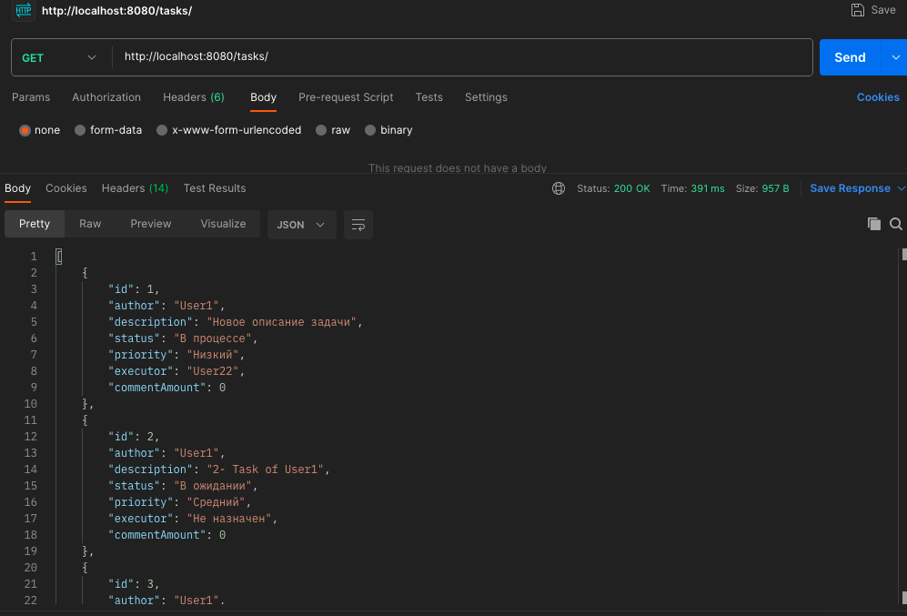
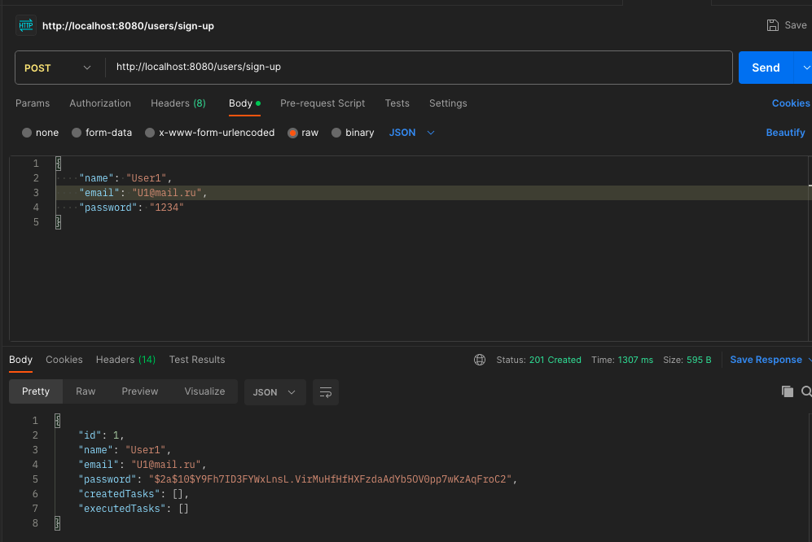
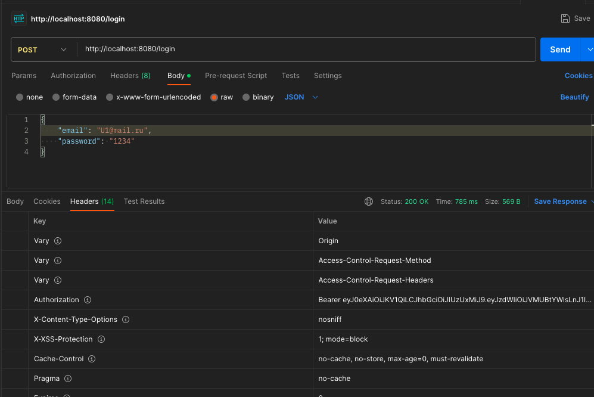
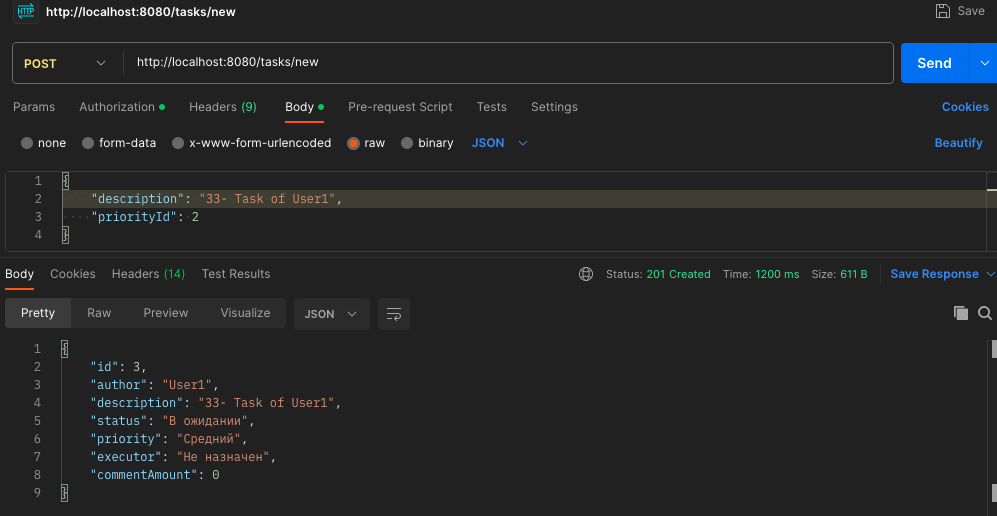
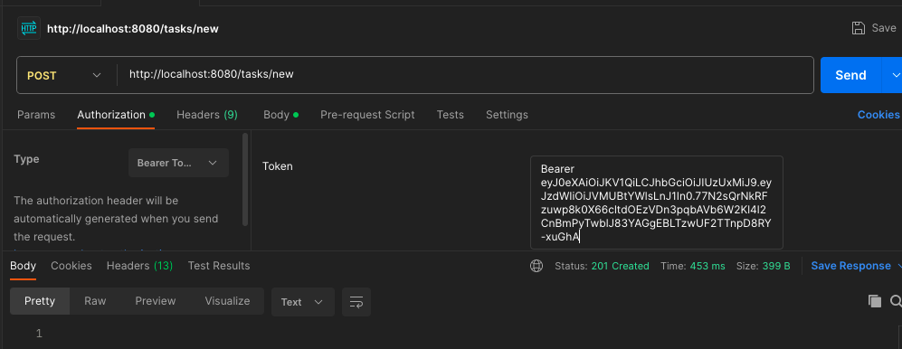

# **RestFull приложение по постановке задач**

## Welcome!


       
## Используемые технологии:

Java 17

Spring Boot (v2.7.3)

Maven 4.0.0

Liquibase 

PostgresSQL

Junit 

Lombok

## Требования к окружению

Maven 3.8.1

OpenJDK 17

Postgresql 14 


## Запуск приложения

### 1. Запуск приложения с maven. 
Перейдите в корень проекта через командную строку и выполните команды:

```
mvn clean install
```

```
mvn spring-boot:run
```

### 2. Запуск приложения  через Docker.
Создайте через консоль папку task_menage_sys, войдите в нёё:

```
mkdir task_menage_sys
cd task_menage_sys 
```

Скачайте проект
```
git clone https://github.com/Arcady555/TaskManagementSystem
```
Соберите контейнер
```
docker-compose build
```
Запускайте!
```
docker-compose up -d
```
Дальше будут перечислены возможные команды, в виде REST-запросов, которые Вы можете отправить с помощью любого доступного Вам приложения(Например curl или PostMan)

## Команды, доступные без авторизации:

Показать список всех задач:<br />
GET запрос на http://localhost:8080/tasks/ :

Показать задачу, выбранную по её ID:<br />
GET запрос на http://localhost:8080/tasks/ID

Посмотреть комментарии к задаче:<br />
GET запрос на http://localhost:8080/tasks/ID/comments

Написать комментарии к задаче:<br />
POST запрос на http://localhost:8080/tasks/ID/new_comment
```
"Ваш комментарий в кавычках без скобок"
```
Показать список всех пользователей:<br />
GET запрос на http://localhost:8080/persons/all

Показать пользователя, выбранного по его ID:<br />
GET запрос на http://localhost:8080/persons/ID

Показать какие задачи создал пользователь, выбранный по его ID:<br />
GET запрос на http://localhost:8080/tasks/author/ID

Показать какие задачи выполняет пользователь, выбранный по его ID:<br />
GET запрос на http://localhost:8080/tasks/executor/ID

Регистрация на сервере:<br />
POST запрос на http://localhost:8080/users/sign-up
```
{
    "name": "ВАШЕ ИМЯ(Не пустая строка !!!)",
    "email": "A@mail.ru(правильный формат, с @ !!!)",
    "password": "1234(Не менее 4х символов !!!)"
}
```



Получение BEER токенa для авторизованной работы:<br />
POST запрос на http://localhost:8080/login :
```
{
    "email": "A@mail.ru",
    "password": "1234"
}
```


## Команды, доступные с авторизацией (вводом полученного BEER токенa):

Публикация задачи на сервере:<br />
POST запрос на http://localhost:8080/tasks/new :
```
{
    "description": "Описание задачи",
    "priorityId": 2,
    "statusId": 1,
    "executorId": 2
}
```
Можно написать только первые 2 строки. Тогда статус задачи по умолчанию будет "В ожидании", а исполнитель "не назначен" 



Изменение данных по выбранной задаче(по её ID)(если Вы являетесь её автором):<br />
PUT запрос на http://localhost:8080/tasks/ID/update :
```
{
    "description": "Новое описание задачи",
    "priorityId": 2,
    "statusId": 1,
    "executorId": 2
}
```
Можете написать только ту строку или строки, которые Вы хотите изменить.

Изменение статуса выбранной задаче(по её ID)(если Вы являетесь её исполнителем):<br />
PUT запрос на http://localhost:8080/tasks/ID/updateStatus :
```
{
    "statusId": 2
}
```
Удаление выбранной задачи(по её ID)(если Вы являетесь её автором):<br />
DELETE запрос на http://localhost:8080/tasks/ID/delete
```
2
```
(Просто написать в запросе ID задания без скобок и кавычек)

<br />
<br />
<br />
Swagger ссылка на проект: <br />
http://localhost:8080/swagger-ui/index.html


## Have a good job!
